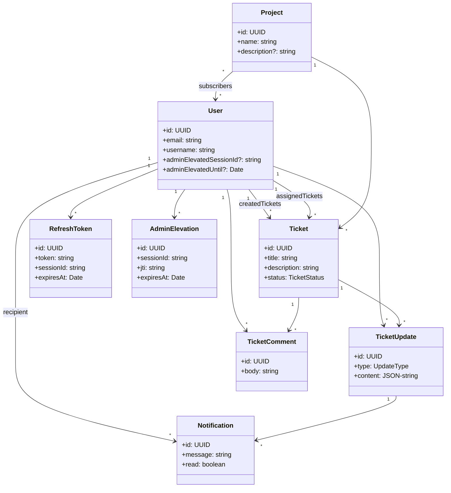

# TicketDashboard — Monorepo

End-to-end ticketing board with projects, Kanban, realtime updates, notifications, and passwordless auth. Monorepo managed with Turborepo.

## Tech Stack

- Backend: Node.js, Express 5, TypeScript, Prisma, PostgreSQL, BullMQ, ioredis, Socket.IO
- Frontend: React 19, Vite, React Router, Zustand, dnd-kit, Tailwind, Sonner
- Infra: Redis (presence, rate limits, queues), SMTP (SendGrid), Render for hosting
- Shared: Types, schemas, constants across apps via `@repo/shared`

## Architecture



Key flows:

- Passwordless login → OTP email → access JWT (short) + refresh cookie (long)
- Multi-device sessions persisted in DB; access JWT validated + session checked
- Realtime via Socket.IO namespaces/rooms: `user:{id}`, `project:{id}`
- Notifications: live to online users, queued email for offline users
- Admin elevation: short-lived admin JWT allowlisted in Redis, single-session lock

## Monorepo Layout

- `apps/backend` — API, sockets, queues, Prisma
- `apps/frontend` — SPA with Kanban board and realtime UX
- `packages/shared` — constants, schemas, types used by both

## Local Development

Prerequisites: Node 18+, PostgreSQL, Redis

1. Install deps

```powershell
npm ci
```

2. Configure environment

- Backend: copy env (see `apps/backend/README.md` for details)
- Frontend: set `VITE_API_URL` to your backend URL (e.g., http://localhost:3000)

3. Database and Prisma

```powershell
cd apps/backend ; npx prisma migrate dev ; npx prisma generate ; cd ../..
```

4. Start dev servers (in two terminals)

```powershell
npm run dev --workspace apps/backend
npm run dev --workspace apps/frontend
```

Frontend runs on `http://localhost:5173`, backend on `http://localhost:3000` by default.

## Production Deployment (Render)

Backend service:

- Build command:
  `npm ci --include=dev ; npx prisma generate --schema=apps/backend/prisma/schema.prisma; npx turbo run build --filter=./apps/backend`
- Start command:
  `npx prisma migrate deploy --schema=apps/backend/prisma/schema.prisma; npm run start -w apps/backend`
- Required env (examples):
    - `NODE_ENV=production`
    - `PORT=3000`
    - `DATABASE_URL=...`
    - `REDIS_URL=...`
    - `ALLOWED_ORIGINS=https://your-frontend-domain,http://localhost:5173`
    - `COOKIE_SAME_SITE=none` and `COOKIE_SECURE=true`
    - SMTP creds (see backend README)

Frontend static site:

- Build: `npm run build -w apps/frontend`
- Env: `VITE_API_URL=https://your-backend-domain`
- SPA rewrite: rewrite all paths `/*` → `/index.html` (no redirect) so deep links like `/login` work.

## System Design Highlights

- Short-lived access JWT + long-lived refresh cookie for strong security and smooth UX
- Sessions in DB enable multi-device login, device management, audit, and server-side invalidation
- Redis used for:
    - Rate limiting keys `rl:*`
    - Presence `presence:users`, `presence:user:{id}:count`
    - Admin allowlist `admin:jti:{jti}` and user pointers `user:{id}:admin_elevation`
    - Admin expiry tracking `zset admin:expirations`
- BullMQ queues for email (OTP / notifications) with priorities and retries
- Socket.IO with Redis adapter to enable horizontal scalability across instances

## Where to Read More

- Backend API, models, CORS, sessions, admin elevation, realtime, queues: `apps/backend/README.md`
- Frontend architecture, state, components, realtime, flows: `apps/frontend/README.md`
- Shared constants, schemas, error codes: `packages/shared/README.md`

## Future Improvements

- Pagination and filters for tickets and updates
- Full-text search and tag system
- Role-based access control beyond temporary elevation
- Webhook integrations for CI/CD on `DEPLOYED` tickets
- Structured logging and metrics (OpenTelemetry)
- E2E tests and contract tests between frontend/backend
- Separate Teams, each user being part to certain teams only, within separate organizations
